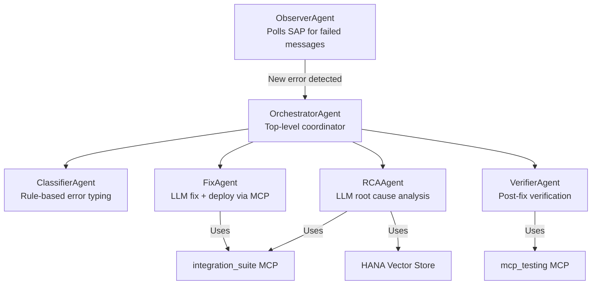

# Agent System Overview

The self-healing system is built on six specialist agents. Each agent has a single clear responsibility and communicates through the `OrchestratorAgent`.

---

## Agent Map

---

## Responsibility Summary

| Agent | File | Key Method | Uses LLM | Uses MCP |
|---|---|---|---|---|
| [OrchestratorAgent](orchestrator.md) | `agents/orchestrator_agent.py` | `process_detected_error()` | No | Indirectly |
| [ObserverAgent](observer.md) | `agents/observer_agent.py` | `start()` | No | No |
| [ClassifierAgent](classifier.md) | `agents/classifier_agent.py` | `classify_error()` | No | No |
| [RCAAgent](rca.md) | `agents/rca_agent.py` | `run_rca()` | Yes | Read-only |
| [FixAgent](fix.md) | `agents/fix_agent.py` | `ask_fix_and_deploy()` | Yes | Full write |
| [VerifierAgent](verifier.md) | `agents/verifier_agent.py` | `test_iflow_after_fix()` | No | Test only |

---

## Shared Utilities (`agents/base.py`)

All agents share these from `agents/base.py`:

### Pydantic Models

| Model | Fields |
|---|---|
| `QueryRequest` | `query`, `id`, `user_id` |
| `QueryResponse` | `response`, `id`, `error` |
| `ApprovalRequest` | `approved`, `comment` |
| `DirectFixRequest` | `iflow_id`, `error_message`, `proposed_fix`, `user_id` |

### Helpers

- `formatjson(text)` — JSON parse with `ast.literal_eval` fallback
- `TestExecutionTracker` — correlates test payloads with message IDs
- `StepLogger(BaseCallbackHandler)` — LangChain callback that logs tool calls and results
