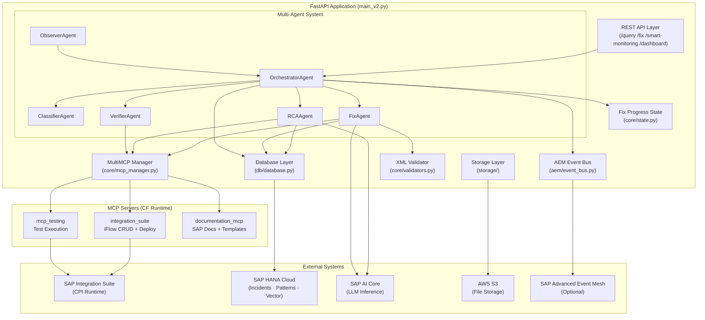

# Architecture Overview

## High-Level System Diagram



---

## Module Responsibilities

| Module | Responsibility |
|---|---|
| `main_v2.py` | FastAPI app, lifespan, endpoint routing, agent wiring, AEM subscriptions |
| `agents/orchestrator_agent.py` | Top-level pipeline coordinator; routes incidents to correct agent |
| `agents/observer_agent.py` | Background polling loop; token caching; OData fetch |
| `agents/classifier_agent.py` | Rule-based error type classification; no LLM, no I/O |
| `agents/rca_agent.py` | LLM + vector store root cause analysis; read-only MCP access |
| `agents/fix_agent.py` | LLM-driven iFlow fix + deploy via MCP; lock handling; timeout diagnosis |
| `agents/verifier_agent.py` | Post-deploy verification; replay failed messages; test payload injection |
| `core/mcp_manager.py` | MCP client connections, tool discovery, LangChain agent builder |
| `core/constants.py` | All environment-sourced config, prompt templates, SAP reference scripts |
| `core/state.py` | In-memory `FIX_PROGRESS` dict; updated live during fix execution |
| `core/validators.py` | Pre-update iFlow XML structural checker (7 rules) |
| `db/database.py` | HANA/SQLite CRUD: incidents, patterns, history, escalation tickets |
| `storage/storage.py` | File upload orchestration (S3 + DB metadata) |
| `storage/object_store.py` | Low-level S3 `boto3` operations |
| `utils/vector_store.py` | HANA vector search for SAP Notes |
| `utils/utils.py` | HANA timestamp helpers, MCP response formatter |
| `utils/logger_config.py` | Rotating file logger setup |
| `utils/xsd_handler.py` | XSD parsing and validation |
| `aem/event_bus.py` | In-process pub/sub with optional AEM REST delivery |
| `smart_monitoring.py` | `/smart-monitoring/*` router |
| `smart_monitoring_dashboard.py` | `/dashboard/*` analytics router |
| `config/config.py` | Settings class; runtime config toggle persistence |

---

## Dependency Rules

```
main_v2.py
  └── agents/          ← import core/, db/, utils/
        └── core/      ← import nothing from agents/ or main_v2.py
  └── smart_monitoring.py  ← lazy-imports main_v2.py at request time
  └── db/              ← import nothing from agents/, main_v2.py
  └── utils/           ← import nothing from agents/, db/, main_v2.py
  └── storage/         ← import db/, utils/ only
  └── aem/             ← no dependencies on agents/ or db/
```

!!! warning "Circular Import Rule"
    `db/` and `utils/` must never import from `main_v2.py` or `agents/`. `smart_monitoring.py` uses a lazy import of `main_v2` to avoid circular dependency at module load time.

---

## Request Lifecycle

```
HTTP Request
  ↓
FastAPI Router (main_v2.py)
  ↓
_guard() — check MCP is connected
  ↓
OrchestratorAgent.ask() or execute_incident_fix()
  ↓
  ├── ClassifierAgent (sync, no I/O)
  ├── RCAAgent (async, LLM + MCP read-only)
  └── FixAgent (async, LLM + MCP write)
        ├── validators.py (pre-update check)
        ├── MultiMCP.execute("get-iflow")
        ├── MultiMCP.execute("update-iflow")
        └── MultiMCP.execute("deploy-iflow")
              ↓
          VerifierAgent (async, MCP test only)
              ↓
          DB update (HANA)
              ↓
          AEM publish (in-process or REST)
```

---

## State Management

The system uses two persistence layers:

| Layer | What | Where |
|---|---|---|
| In-memory | `FIX_PROGRESS` tracker | `core/state.py` — lost on restart |
| Persistent | Incidents, patterns, history, tickets | SAP HANA Cloud via `db/database.py` |

Fix progress is written to memory during execution and polled via `GET /fix-progress/{incident_id}`. On completion, the final state is written to HANA.
