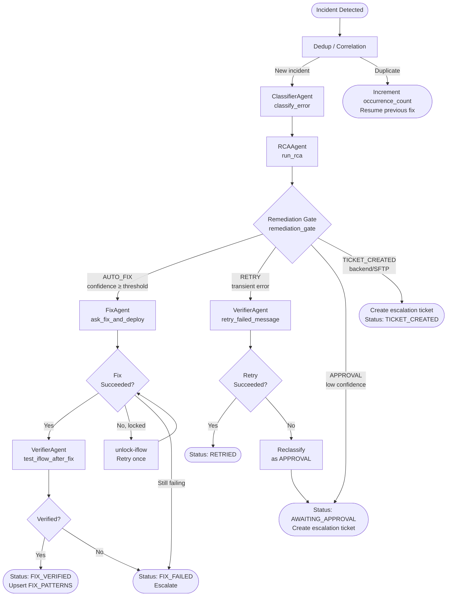

# Fix Pipeline

End-to-end flow from incident detection to verified resolution.

---

## Pipeline Diagram



---

## Step 1 — Deduplication

**Function:** `OrchestratorAgent._dedup(payload)`

```python
signature = classifier.error_signature(iflow_id, error_type, error_message)
existing = db.get_incident_by_signature(signature, within_seconds=BURST_DEDUP_WINDOW_SECONDS)
if existing:
    db.update_incident(existing.id, occurrence_count=existing.occurrence_count + 1)
    return  # Skip; do not reprocess
```

---

## Step 2 — Classification

**Function:** `ClassifierAgent.classify_error(error_message)`

- No I/O; purely string matching
- Returns: `{error_type, confidence, tags}`
- Error types: `SFTP_ERROR`, `AUTH_ERROR`, `MAPPING_ERROR`, `DATA_VALIDATION`, `CONNECTIVITY_ERROR`, `ADAPTER_CONFIG_ERROR`, `BACKEND_ERROR`, `UNKNOWN_ERROR`

---

## Step 3 — Root Cause Analysis

**Function:** `RCAAgent.run_rca(incident)`

Tool calls in order:
1. `get_vector_store_notes` — semantic SAP Notes search (always first)
2. `get_cross_iflow_patterns` — proven fix history
3. `get-iflow` — read current XML (once)
4. `get_message_logs` — inspect payload (at most once)

Returns: `{root_cause, proposed_fix, confidence, affected_component, key_steps}`

---

## Step 4 — Remediation Gate

**Function:** `OrchestratorAgent.remediation_gate(error_type, confidence)`

| Policy | Trigger | Action |
|---|---|---|
| `AUTO_FIX` | confidence ≥ `AUTO_FIX_CONFIDENCE` | Proceed to FixAgent |
| `AUTO_FIX` | confidence < `AUTO_FIX_CONFIDENCE` | Create approval ticket |
| `RETRY` | Any confidence | Retry via VerifierAgent |
| `APPROVAL` | Any confidence | Create approval ticket |
| `TICKET_CREATED` | Any confidence | Create escalation ticket |

---

## Step 5 — Fix and Deploy

**Function:** `FixAgent.ask_fix_and_deploy(incident)`

LLM-driven execution:
1. `get-iflow` — fetch current XML
2. (Optional) `get_message_logs` — inspect failed payload
3. Compute minimal XML change
4. Pre-update validation via `core/validators.py`
5. `update-iflow` — upload modified XML
6. `deploy-iflow` — trigger SAP deployment

**Lock handling:** If `update-iflow` returns "is locked" → unlock → retry once.

**Timeout:** Max 600 seconds. On timeout, runtime status is polled to determine which stage completed.

---

## Step 6 — Verification

**Function:** `VerifierAgent.test_iflow_after_fix(incident)` or `retry_failed_message(incident)`

1. `check_iflow_runtime_status` — confirm STARTED state
2. Replay original failed message (if GUID available) OR inject test payload
3. Check response

---

## Step 7 — Outcome

| Result | HANA Status | Action |
|---|---|---|
| Fix applied, deploy OK, verified OK | `FIX_VERIFIED` | Upsert `FIX_PATTERNS` with success |
| Fix applied, deploy OK, verify failed | `FIX_FAILED` | Escalate ticket |
| Fix applied, deploy failed | `DEPLOY_FAILED` | Escalate ticket |
| Fix not applied (validation error) | `FIX_FAILED` | Log, escalate |
| Timeout | `FIX_TIMEOUT` | Poll runtime status, escalate |

---

## Fix Pattern Learning

On `FIX_VERIFIED`, the Orchestrator calls:

```python
db.upsert_fix_pattern(
    signature=error_signature,
    iflow_id=iflow_id,
    error_type=error_type,
    proposed_fix=proposed_fix,
    success_count=existing.success_count + 1,
    key_steps=fix_agent_output.key_steps,
)
```

Patterns with `success_count >= PATTERN_MIN_SUCCESS_COUNT` are returned by `get_cross_iflow_patterns` to future RCA calls, enabling the system to reuse proven fixes.

---

## Rollback

If a fix fails post-deployment, the pre-fix snapshot stored in `iflow_snapshot_before` can be used to manually restore the iFlow. Automatic rollback is not implemented — the snapshot is preserved as a reference for human rollback.
